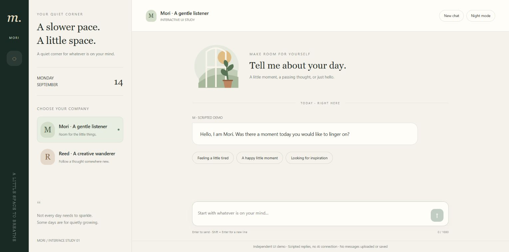

# Mori — frontend interface study

An independent, AI-assisted HTML/CSS/JavaScript sample prepared for wkkxkc. This is a portfolio exercise, not a paid client deployment or evidence of professional employment history.

## Try it

Download [mori-en.html](mori-en.html) from its GitHub file page and open the saved file in a modern browser. No installation, login or external services are needed. [Chinese version](mori.html).

The sample includes an original inline SVG window illustration, two conversation personas, light/dark themes, starter prompts, Enter-to-send, multiline input and a reset action. Replies are scripted locally. It does not connect to an AI backend, upload messages or persist them.

## What was verified

The English page rendered in desktop Microsoft Edge; its inspiration starter produced the expected scripted reply and reset cleared the conversation. The shared Chinese implementation was also exercised for persona changes, theme changes, sending text and treating HTML-like input as plain text. A shortcut-visibility defect was found and fixed. Mobile CSS is present, but actual mobile and cross-browser acceptance testing is not complete.

## Scope and authorship

Created with AI assistance for demonstrating frontend implementation and written collaboration. No Webflow certification, paid customer case study, years of experience or production-readiness claim is made. This showcase branch is separate from the repository's original OpenCode project; that upstream project is not represented as our portfolio work.

Interested in a small, clearly specified frontend task? Contact a89870839@protonmail.com. Availability, price, acceptance criteria and any production access would be agreed before work begins.