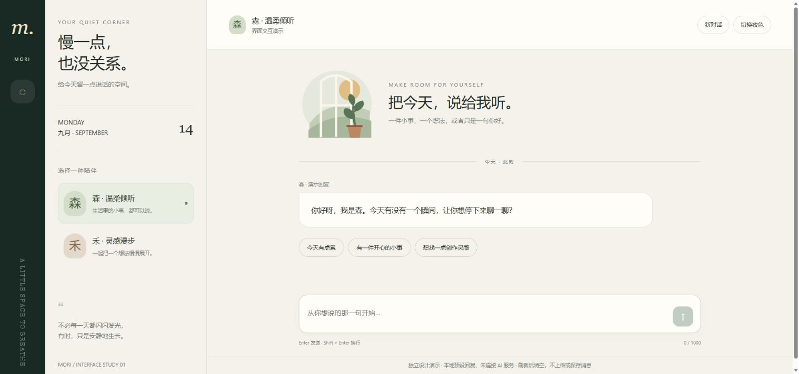

# Mori · 对话界面交互演示

这是 wkkxkc 为前端合作申请制作的 AI 辅助独立样例，不是上线客户案例。

本分支仅用于作品展示，与 OpenCode 上游项目没有产品或贡献归属关系。

## 体验

打开 [mori.html](mori.html)，点击文件页的下载按钮，保存后使用现代浏览器打开。单文件，无依赖、无需登录。

实现了日夜主题、角色切换、快捷开场、消息发送、换行和新对话。回复为本地预设，没有接入真实 AI，不上传或持久保存消息。

已在桌面浏览器验证角色切换、主题、发送和清空；输入的 HTML 按纯文本显示。含移动端样式，尚未在真实手机验收。

页面仅为视觉与交互样例。生产接入、数据保存和业务功能需另行约定。
